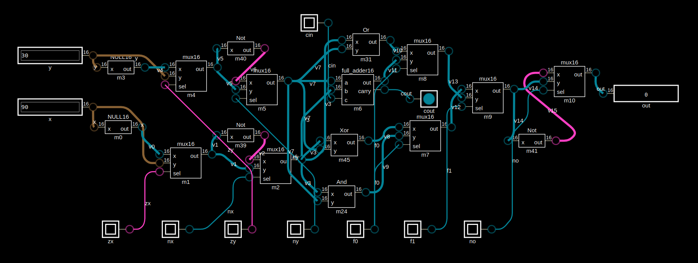

xkarna ALU
------------

This peace of hardware was created for a custom 16-bit computer called **xkarna**. there
is no real physical hardware yet. will update when I make one

* does 22 operations
* 16-bit
* here is the [simulated version](https://digitaljs.tilk.eu/#e96526d30899acc1199f2284dec1a40fde974a33adacf5d6783fceb8b5ed6a3a)
* check the verilog [file](alu.v)

Truth Table
------------

| zx | nx | zy | ny | f0 | f1 | no | operation |
|----|----|----|----|----|----|----|-----------|
|  1 |    |  1 |    |    |    |    | 0         |
|  1 |  1 |  1 |  1 |    |    |  1 | 1         |
|  1 |  1 |  1 |    |    |    |    | -1        |
|    |    |  1 |    |    |    |    | x         |
|  1 |    |    |    |    |    |    | y         |
|    |  1 |  1 |  1 |    |    |  1 | x+1       |
|  1 |  1 |    |  1 |    |    |  1 | y+1       |
|    |    |    |    |    |    |    | x + y     |
|    |    |  1 |  1 |    |    |  1 | -x        |
|  1 |  1 |    |    |    |    |  1 | -y        |
|    |    |  1 |  1 |    |    |    | x-1       |
|  1 |  1 |    |    |    |    |    | y-1       |
|    |  1 |    |    |    |    |  1 | x-y       |
|    |    |    |  1 |    |    |  1 | y-x       |
|    |    |  1 |    |    |    |  1 | not x     |
|  1 |    |    |    |    |    |  1 | not y     |
|    |    |    |    |    |  1 |    | x and y   |
|    |    |    |    |  1 |    |    | x or y    |
|    |    |    |    |  1 |  1 |    | x xor y   |
|    |    |    |    |    |  1 |  1 | x nand y  |
|    |    |    |    |  1 |    |  1 | x nor y   |
|    |    |    |    |  1 |  1 |  1 | x xnor y  |
